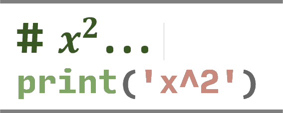
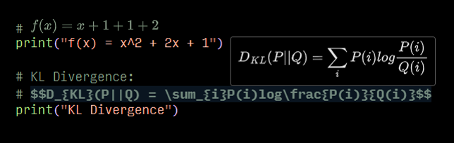

<!--  -->
<br>

<p align="center">

</p>

<h1 align="center">Comment Formula</h1>

# Introduction
A VSCode extension to render LaTeX formula in comment. Now you can use it in **python**.  
Extension code is modified from [vscode-iconify](https://github.com/antfu/vscode-iconify)

## Feature


## Configure options
- `comment-formula.inlineColor`: The color of the rendered formula inline the editor. Default is `auto`.
- `comment-formula.messageColor`: The color of the rendered formula in message. Default is `auto`.
- `comment-formula.inline`: The inline mode of the rendered formula. Default is `all`.  
  - `all`: Render all formula in inline mode.
  - `none`: You can just hover on the formula to preview it.
  - `partial`: Render formula in inline mode if the formula isn't too large.

For example:
```json
{
  "comment-formula.inlineColor": "#667466",
  "comment-formula.messageColor": "auto",  
  "comment-formula.inline": "partial",
}
```