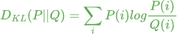

<br>

<p align="center">

</p>

<h1 align="center">Comment Formula</h1>

## Introduction
A VSCode extension to render LaTeX formula in comment. Now you can use it in **python**.
> This extension is modified from [vscode-iconify](https://github.com/antfu/vscode-iconify) and use [markdown-it](https://github.com/markdown-it/markdown-it) and [markdown-it-mathjax3](https://github.com/tani/markdown-it-mathjax3) to render formula.

## Feature
You are supposed to write formula between `$$` and `$$`.
Now just support write formula in one-line comment in python.  
<div style="
  background-color: #dd666622; 
  padding: 8px; 
  border-radius: 4px; 
  margin-bottom: 12px;
  white-space: nowrap;
  overflow: hidden;"
>
  <span style="
    color: #dd6666; 
    font-weight: bold; 
    margin: 4px;"
  >
    - Before:
  </span>
  <div style=
    "margin: 8px; 
    font-family: ui-monospace, consolas, monospace;
    color: #57A64A; 
    line-height:1.25; 
    font-size: 14px;"
  >
    <div># Function</div>
    <div># $$f(x) = x^2 + 2x + 1$$</div>
    <div># KL Divergence</div>
    <div># $$D_{KL}(P||Q) = \sum_{i}P(i)log\frac{P(i)}{Q(i)}$$</div>
  </div>
</div>  

<div style="
  background-color: #85e7a222; 
  padding: 8px; 
  border-radius: 4px; 
  margin-bottom: 12px;
  white-space: nowrap;
  overflow: hidden;"
>
  <span style="
    color: #22aa55; 
    font-weight: bold; 
    margin: 4px;"
  >
    + After:
  </span>  
  <div style="
    margin: 8px; 
    font-family: ui-monospace, consolas, monospace; 
    color: #57A64A; 
    line-height:1.2; 
    font-size: 14px;"
  >
    <div style="display: flex;">
      <div>
      <div># Function</div>
        <div>
          # 
        </div>
        <div># KL Divergence</div>
      </div>
      <div style="
        margin-left: 8px; 
        border-radius: 4px; 
        background-color: #6786;
        display: flex; 
        align-items: center; 
        padding: 4px 8px 4px 8px;
        min-width: 200px;
        height: 40px;"
      >
        
      </div>
    </div>
    <div style="font-weight: bold;">
      # <span style="background: #7894; border-radius: 2px;">$$D_{KL}(P||Q) = \sum_{i}P(i)log\frac{P(i)}{Q(i)}$$</span>
    </div>
  </div>
</div>  

> In `partial inline mode`, if the formula is too large(height is much higher than the height line in your editor), you can hover the formula and you can find it's rendered in the message box(Just like the second formula in the above example).

## Configuration
- `comment-formula.inlineColor`: The color of the rendered formula inline the editor. Default is `auto`.
- `comment-formula.messageColor`: The color of the rendered formula in message. Default is `auto`.
- `comment-formula.inline`: The inline mode of the rendered formula. Default is `partial`.  
  - `all`: Render all formula in inline mode.
  - `none`: You can just hover on the formula to preview it.
  - `partial`: Render formula in inline mode if the formula isn't too large.

For example:
```json
{
  "comment-formula.inlineColor": "#667466",
  "comment-formula.messageColor": "auto",  
  "comment-formula.inline": "partial",
}
```

## License
code is licensed under [MIT License](./LICENSE)